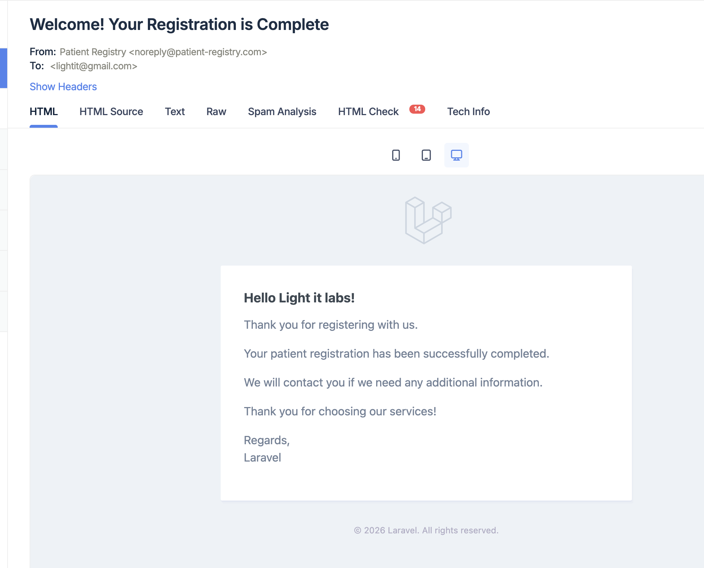

# Patient Registry Application

A full-stack patient registration application built with Laravel (Backend) and React + TypeScript (Frontend).

## Setup Instructions

### 1. Clone the Repository

```bash
git clone git@github.com:pauchena/patient-registration.git
cd patient-registry
```

### 2. Backend Setup

```bash
cd backend

# Build and start Docker containers
docker-compose up -d --build

# The migration will run automatically, but if needed:
docker exec -it laravel_app php artisan migrate

# Create storage symlink (runs automatically in docker-compose)
docker exec -it laravel_app php artisan storage:link
```

The backend will be available at `http://localhost:8000`

### 3. Frontend Setup

```bash
cd frontend

# Install dependencies
npm install

# Start development server
npm run dev
```

The frontend will be available at `http://localhost:3000`

### 4. Configure Mailtrap (Email Testing)

1. Sign up for a free account at [Mailtrap.io](https://mailtrap.io)
2. Get your SMTP credentials from the inbox settings
3. Update the following in `backend/.env`:
   ```
   MAIL_USERNAME=your_mailtrap_username
   MAIL_PASSWORD=your_mailtrap_password
   ```
4. Restart the backend container:
   ```bash
   cd backend
   docker-compose restart app queue
   ```

## Development Testing Notes

- Tested in a local development environment using Docker and Mailtrap.
- Emails are being sent correctly, but they do not arrive in real inboxes because Mailtrap is a sandbox SMTP service that captures messages for inspection.



## API Endpoints

### Get All Patients

```
GET /api/v1/patients
```

**Response:**

```json
{
  "success": true,
  "data": [
    {
      "id": 1,
      "full_name": "John Doe",
      "email": "john@gmail.com",
      "phone_country_code": "+598",
      "phone_number": "12345678",
      "document_photo_url": "http://localhost:8000/storage/documents/...",
      "created_at": "2025-02-05T10:30:00.000000Z"
    }
  ]
}
```

### Register Patient

```
POST /api/v1/patients
Content-Type: multipart/form-data
```

**Request Body:**

- `full_name` (string, required): Only letters and spaces
- `email` (string, required): Must be @gmail.com address, unique
- `phone_country_code` (string, required): Format: +XXX
- `phone_number` (string, required): Only digits
- `document_photo` (file, required): JPG only, max 5MB

**Response (Success):**

```json
{
  "success": true,
  "message": "Patient registered successfully",
  "data": { ... }
}
```

**Response (Validation Error):**

```json
{
  "success": false,
  "message": "Validation failed",
  "errors": {
    "email": ["The email has already been taken."]
  }
}
```

## Validation Rules

- **Full Name**: Required, only letters and spaces
- **Email**: Required, valid email format, must be @gmail.com, unique
- **Phone Country Code**: Required, format: +XXX (1-4 digits)
- **Phone Number**: Required, only digits
- **Document Photo**: Required, JPG/JPEG only, max 5MB

## Additional Features

### Delete Patient Functionality

Although not explicitly required in the initial specification, a **delete patient feature** has been implemented to enhance testing and user experience. This allows users to:

- Remove previously registered patients
- Re-register a patient with the same email address after deletion
- Confirmation modal prevents accidental deletions

**Endpoint:**

```
DELETE /api/v1/patients/{id}
```

**Response:**

```json
{
  "success": true,
  "message": "Patient deleted successfully"
}
```


## Development Commands

### Backend

```bash
# Enter Laravel container
docker exec -it laravel_app bash

# Run migrations
php artisan migrate

# Clear cache
php artisan cache:clear
php artisan config:clear

# View logs
tail -f storage/logs/laravel.log

# Queue worker (runs in separate container)
php artisan queue:work
```

### Frontend

```bash
# Development server
npm run dev

# Build for production
npm run build

# Preview production build
npm run preview

# Lint code
npm run lint

# Format code
npm run format
```

## Testing

### Backend Unit Tests

```bash
cd backend
php artisan test --testsuite=Unit
```

### Frontend Unit Tests

```bash
cd frontend
npm test -- --run
```

## Docker Services

The application runs three Docker services:

1. **app** (Laravel application) - Port 8000
2. **queue** (Laravel queue worker) - Background email processing
3. **postgres** (PostgreSQL database) - Port 5432

## Future Enhancements

The application is prepared for SMS notifications:

1. The `PatientRegisteredNotification` class has a commented method `toSms()`
2. Integrate with an SMS service (e.g., Twilio, AWS SNS)
3. Add phone number verification

## License

This project is created for evaluation purposes.
